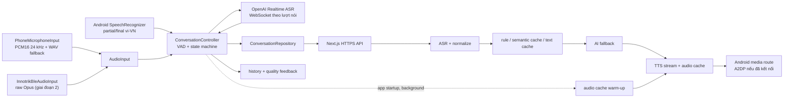
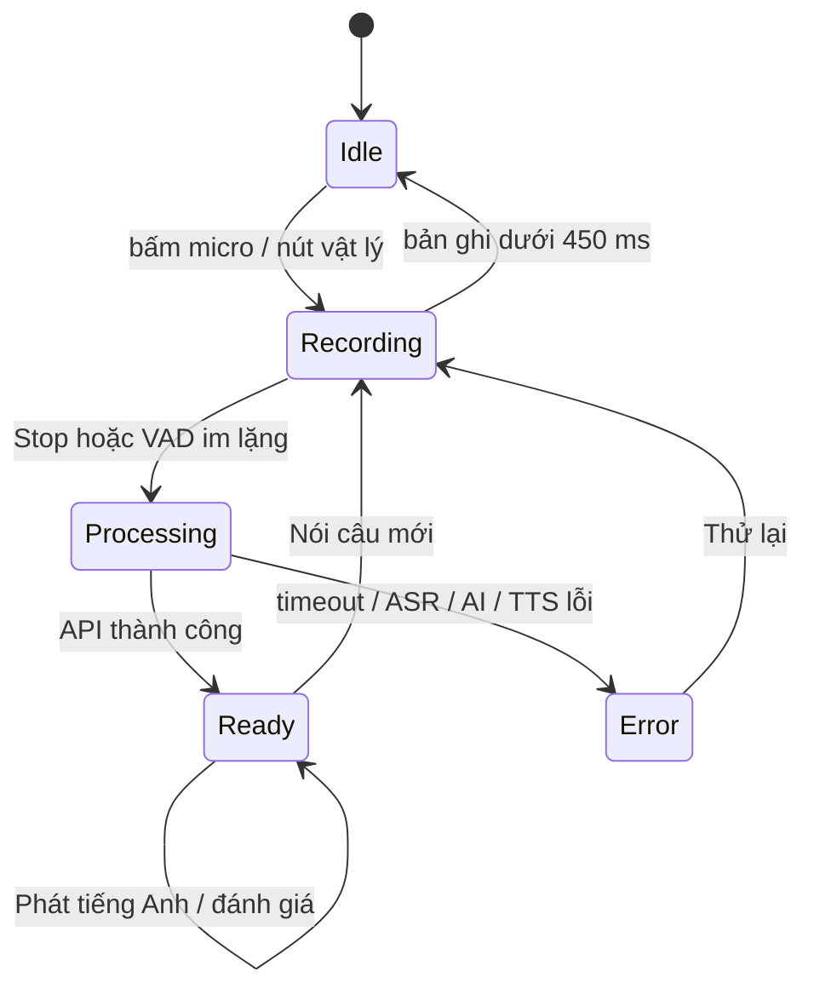

# Kiến trúc Flutter + Next.js

## Quyết định chính

Flutter là mobile client native. Next.js tiếp tục là backend và là nơi duy nhất
giữ API key, prompt, rule/cache, lịch sử, báo cáo và telemetry. Không port logic
AI sang Dart.

## State machine

## Cấu trúc code

- `core/audio`: abstraction thu âm, playback và contract INNOTRIK.
- `features/conversation/domain`: model và repository interface.
- `features/conversation/data`: adapter cho API Next.js và demo adapter.
- `features/conversation/presentation`: controller, màn hình và widget.
- `features/settings`: cài đặt ngữ cảnh, ASR, VAD và lịch sử.
- `android/...`: manifest quyền và native channel skeleton.

Controller chỉ biết interface, nên thay nguồn âm thanh không làm thay đổi UI.

## Luồng mic điện thoại

1. Mặc định Android `SpeechRecognizer` nhận partial/final tiếng Việt và gửi text
   vào cùng pipeline backend như web streaming.
2. Nếu dịch vụ Android không khả dụng hoặc người dùng chọn OpenAI Realtime,
   `record` mở micro PCM16 mono 24 kHz và đồng thời tạo client secret, mở
   WebSocket cho đúng lượt nói. Audio trước lúc kết nối được giữ trong buffer và
   replay đúng một lần khi WebSocket sẵn sàng; app không tạo session khi chỉ mở màn hình.
3. Stream dBFS điều khiển hiển thị mức âm và VAD.
4. Sau khi phát hiện tiếng nói, im lặng liên tục 700 ms sẽ tự dừng.
5. Người dùng luôn có thể bấm Dừng.
6. Partial transcript chỉ dò rule/cache để preload audio đã có. Sau Stop,
   Realtime commit buffer và final text mới đi qua pipeline backend một lần.
7. Khi Realtime hoạt động, Flutter giữ một bản PCM giới hạn 15 MiB trong RAM
   nhưng chưa upload batch. Nếu tạo session thất bại thì batch được bật trước
   lúc ghi; nếu finalize Realtime thất bại thì buffer mới được replay qua Batch
   Chunks. Chỉ khi batch cũng lỗi mới upload toàn bộ WAV.
8. Backend trả `audioUrl`; `just_audio` phát URL qua Android media route.
9. Client PATCH lại time-to-first-audio và đánh giá chất lượng.

## Luồng BLE offline lai

1. Luồng này chỉ được chọn khi adapter INNOTRIK và engine offline native cùng báo
   sẵn sàng; mic điện thoại vẫn giữ Android Streaming.
2. APK tải 34 ý định semantic từ backend và cache trước audio tiếng Anh tương ứng.
3. PCM giải mã từ Opus được đưa đồng thời vào bộ đệm cục bộ và recognizer offline.
4. Chỉ chấp nhận intent khi confidence tối thiểu 0,88, margin tối thiểu 0,15 và
   cùng một intent ổn định 3 lần liên tiếp.
5. Nếu sau 800 ms từ lúc có giọng nói vẫn chưa chắc chắn, Flutter mở Realtime sớm
   và replay phần PCM đã đệm. Nếu Realtime lỗi, Batch Chunks/WAV vẫn là lớp cuối.
6. Khi intent offline chắc chắn, transcript đi qua pipeline rule/cache backend với
   `asrMode=ble_offline_intent`; không phát sinh OpenAI ASR cho lượt đó.

## Ranh giới bảo mật

- Không có `OPENAI_API_KEY` hoặc secret trong Dart/Android resources.
- APK chỉ nhận client secret Realtime sống ngắn cho đúng một phiên ASR.
- Base URL truyền bằng `--dart-define`; đây là cấu hình, không phải secret.
- Release manifest chặn HTTP cleartext.
- Keystore, mật khẩu ký và file cấu hình riêng bị loại khỏi Git.
- Backend production cần auth theo thiết bị/người dùng trước khi public.

## Những việc backend phải harden trước production

Backend hiện đủ cho MVP local, nhưng cần các thay đổi sau khi deploy:

1. Xác thực và giới hạn rate theo thiết bị/người dùng.
2. History/report phải scope theo account, không dùng dữ liệu global.
3. Audio session/chunk cần TTL cleanup và finalize idempotent.
4. Audio/history/cache cần storage bền vững; không dựa vào local filesystem nếu
   chạy serverless.
5. Log phải bỏ nội dung nhạy cảm của trẻ và có retention policy.
6. Endpoint TTS cần cache headers/range behavior được kiểm tra với Android.
7. Health/version endpoint để app chặn backend không tương thích.
8. Warm-up endpoint cần rate limit hoặc chuyển thành deploy job khi public;
   không đặt secret quản trị trong APK.

## Quyết định UX

Màn hình chính không hiển thị latency, source rule/AI hay benchmark. Các dữ liệu
này vẫn được gửi về backend để dashboard/admin so sánh web với Flutter. Trẻ chỉ
thấy hành động cần làm và kết quả giao tiếp.
