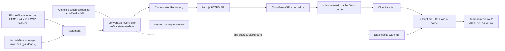
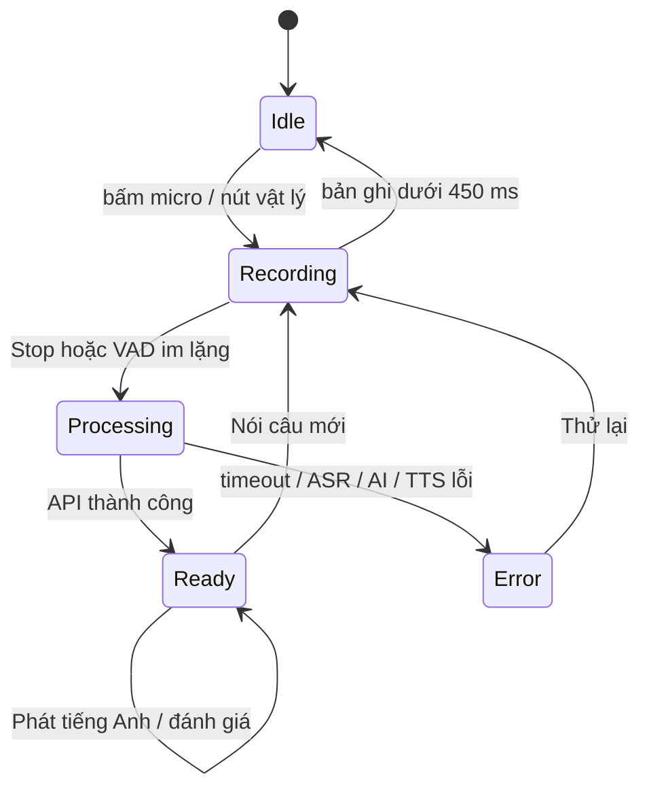

# Kiến trúc Flutter + Next.js

## Quyết định chính

Flutter là mobile client native. Next.js tiếp tục là backend và là nơi duy nhất
giữ API key, prompt, rule/cache, lịch sử, báo cáo và telemetry. Không port logic
AI sang Dart.

## State machine

## Cấu trúc code

- `core/audio`: abstraction thu âm, playback và contract INNOTRIK.
- `features/conversation/domain`: model và repository interface.
- `features/conversation/data`: adapter cho API Next.js và demo adapter.
- `features/conversation/presentation`: controller, màn hình và widget.
- `features/settings`: cài đặt ngữ cảnh, ASR, VAD và lịch sử.
- `android/...`: manifest quyền và native channel skeleton.

Controller chỉ biết interface, nên thay nguồn âm thanh không làm thay đổi UI.

## Luồng mic điện thoại

1. Mặc định Android `SpeechRecognizer` nhận partial/final tiếng Việt và gửi text
   vào cùng pipeline backend như web streaming.
2. Nếu dịch vụ Android không khả dụng, `record` mở micro PCM16 mono 24 kHz và
   gửi audio qua Cloudflare Batch Chunks ở backend.
3. Stream dBFS điều khiển hiển thị mức âm và VAD thích nghi. VAD hiệu chỉnh nền ồn trong 300 ms, dùng ngưỡng bắt đầu/kết thúc riêng và bỏ qua tiếng động ngắn hoặc nền ồn ổn định.
4. Sau khi phát hiện tiếng nói, im lặng liên tục 900 ms sẽ tự dừng theo mặc định; người dùng vẫn có thể chỉnh từ 400–1.600 ms.
5. Người dùng luôn có thể bấm Dừng.
6. Partial transcript Android chỉ dò rule/cache để preload audio đã có. Sau Stop,
   final text mới đi qua pipeline backend một lần.
7. Trên web, câu ngắn hơn 8 giây giữ PCM trong RAM rồi upload WAV bằng một
   request. Câu dài tự chuyển sang audio session để upload chunks song song với
   phần ghi âm còn lại. Nếu transport chunk lỗi kỹ thuật, client mới upload WAV.
8. Backend trả `audioUrl`; `just_audio` phát URL qua Android media route.
9. Client PATCH lại time-to-first-audio và đánh giá chất lượng.

## Luồng BLE offline lai

1. Luồng này chỉ được chọn khi adapter INNOTRIK và engine offline native cùng báo
   sẵn sàng; mic điện thoại vẫn giữ Android Streaming.
2. APK tải 34 ý định semantic từ backend và cache trước audio tiếng Anh tương ứng.
3. PCM giải mã từ Opus được đưa đồng thời vào bộ đệm cục bộ và recognizer offline.
4. Chỉ chấp nhận intent khi confidence tối thiểu 0,88, margin tối thiểu 0,15 và
   cùng một intent ổn định 3 lần liên tiếp.
5. Nếu kết quả offline chưa chắc chắn, Flutter replay phần PCM đã đệm qua
   Cloudflare Batch Chunks. WAV là lớp dự phòng khi transport chunks lỗi.
6. Khi intent offline chắc chắn, transcript đi qua pipeline rule/cache backend với
   `asrMode=ble_offline_intent`; không phát sinh Cloudflare ASR cho lượt đó.

## Ranh giới bảo mật

- Không có khóa Cloudflare hoặc secret nhà cung cấp AI trong Dart/Android resources.
- APK chỉ gọi API Next.js; backend là bên duy nhất gọi Cloudflare Workers AI.
- Base URL truyền bằng `--dart-define`; đây là cấu hình, không phải secret.
- Release manifest chặn HTTP cleartext.
- Keystore, mật khẩu ký và file cấu hình riêng bị loại khỏi Git.
- Mỗi installation có secret ngẫu nhiên và cặp access/refresh token xoay vòng;
  `clientId` chỉ còn là tham chiếu dữ liệu, không còn là bằng chứng sở hữu.
- iOS lưu credential trong Keychain, Android mã hóa bằng Android Keystore và
  web lưu credential riêng theo origin. Scoped audio token luôn gắn với
  installation đã tạo phiên.
- Khi deploy phải cấu hình `INSTALLATION_AUTH_SECRET`; chỉ bật
  `INSTALLATION_AUTH_REQUIRED=true` sau khi bản iOS/Android có token đã được
  phân phối và kiểm thử.

## Những việc backend phải harden trước production

Backend đã có installation authentication và scope history/audio theo token.
Các hạng mục production còn lại:

1. Theo dõi rate limit trên storage dùng chung nếu tăng lên nhiều replica.
2. Report/admin tiếp tục chỉ cho phép admin; history của app đã scope theo
   installation token.
3. Duy trì cleanup TTL cho audio session/chunk và giám sát finalize idempotent.
4. Audio/history/cache cần storage bền vững; không dựa vào local filesystem nếu
   chạy serverless.
5. Log phải bỏ nội dung nhạy cảm của trẻ và có retention policy.
6. Endpoint TTS cần cache headers/range behavior được kiểm tra với Android.
7. Health/version endpoint để app chặn backend không tương thích.
8. Warm-up endpoint cần rate limit hoặc chuyển thành deploy job khi public;
   không đặt secret quản trị trong APK.

## Quyết định UX

Màn hình chính không hiển thị latency, source rule/AI hay benchmark. Các dữ liệu
này vẫn được gửi về backend để dashboard/admin so sánh web với Flutter. Trẻ chỉ
thấy hành động cần làm và kết quả giao tiếp.
