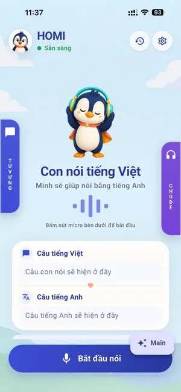
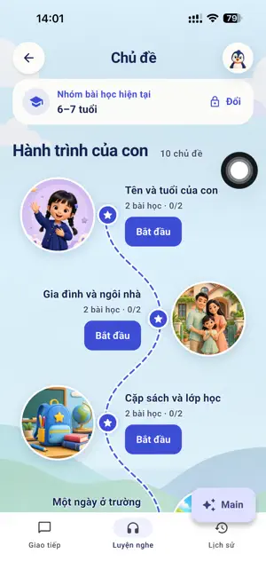
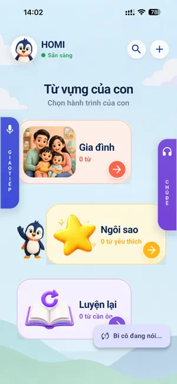
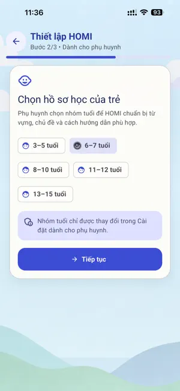

# HOMI UI audit và hướng thiết kế

Ngày đánh giá: 07/09/2026  
Phạm vi: Trang giao tiếp, hành trình chủ đề, hành trình từ vựng và thiết lập nhóm tuổi.  
Mục tiêu: Một hệ thống giao diện dùng chung cho APK, iOS native tương lai và web/PWA; dễ hiểu với trẻ, đủ tin cậy với phụ huynh và không che lấp trạng thái giọng nói.

## Kết luận nhanh

HOMI đã có nền nhận diện tốt: mascot dễ nhớ, bầu trời dịu, indigo làm màu hành động và coral làm điểm nhấn. Vấn đề chính không phải thiếu trang trí mà là có quá nhiều cách điều hướng cùng lúc: tab dọc hai bên, thanh dưới, nút MAIN nổi và CTA ghi âm. Điều này làm vùng thao tác bị chồng, nhãn khó đọc và trạng thái “đang nghe/đang xử lý/đang nói” chưa trở thành trung tâm của trải nghiệm.

Hướng chốt nên là **một khung ứng dụng thống nhất, một hành động chính ở mỗi màn hình và một mô hình trạng thái giọng nói duy nhất**. Giữ mascot và bối cảnh thiên nhiên, nhưng giảm bóng đổ, giảm số “thẻ trong thẻ” và chuyển hai tab dọc thành điều hướng ngang dễ đọc.

## 1. Trang giao tiếp

**Tình trạng: Cần chỉnh cấu trúc, không cần làm lại thương hiệu.**

Điểm tốt:

- Mascot, tiêu đề và nút mic tạo được cảm giác trợ lý thân thiện.
- Hai câu Việt/Anh được đặt cạnh nhau, đúng với nhiệm vụ cốt lõi.
- Indigo hiện đủ mạnh để nhận ra CTA chính.

Rủi ro:

- Hai tab dọc “TỪ VỰNG/CHỦ ĐỀ” khó đọc, chiếm mép thao tác và dựa vào cách xếp chữ không tự nhiên.
- Nút MAIN nổi đè lên vùng CTA; người dùng phải hiểu cùng lúc “MAIN” và “Bắt đầu nói”.
- Mascot, waveform, card dịch, hai tab dọc và CTA đều tranh vai trò chính.
- Placeholder xám nhạt và dòng hướng dẫn nhỏ có nguy cơ thiếu tương phản trên nền sáng.

Khuyến nghị:

- Đặt hai lối tắt “Từ vựng” và “Chủ đề” thành hai nút/chip ngang ngay dưới header hoặc trên thanh điều hướng dưới.
- Dùng một khối “voice stage” ở giữa với 4 trạng thái rõ: Sẵn sàng, Đang nghe, Đang xử lý, HOMI đang nói. Mỗi trạng thái có màu + icon + chữ, không chỉ đổi màu.
- MAIN là nút điều hướng trợ lý cố định trong thanh dưới; CTA mic vẫn là hành động chính của trang giao tiếp và không bị MAIN che.
- Khi chưa có nội dung, thu gọn card Việt/Anh. Khi có kết quả, card mở rộng bằng animation 180–240 ms.

## 2. Hành trình chủ đề

**Tình trạng: Ý tưởng tốt, mật độ và trạng thái tiến độ chưa rõ.**

Điểm tốt:

- Đường hành trình phù hợp trẻ em và tạo cảm giác tiến bộ.
- Ảnh chủ đề giúp trẻ chưa đọc tốt vẫn nhận diện nội dung.
- Nhóm tuổi được hiển thị ở đầu trang, phù hợp quyền kiểm soát của phụ huynh.

Rủi ro:

- Nút “Bắt đầu” lặp lại ở mọi node khiến đường nhìn bị ngắt; khi cuộn, trẻ khó biết bài nào đang học.
- Hoàn thành/đang học/chưa mở chưa khác nhau đủ rõ.
- MAIN nổi che thanh dưới; ba mô hình điều hướng xuất hiện trên cùng màn hình.
- Tiêu đề và số tiến độ nhỏ hơn ảnh, nên ảnh lấn át thông tin học tập.

Khuyến nghị:

- Giữ đường hành trình nhưng chỉ node hiện tại có CTA “Học tiếp”; node khác mở bằng chạm cả vùng.
- Dùng ba trạng thái nhất quán: dấu kiểm = hoàn thành, vòng sáng + “Tiếp tục” = hiện tại, khóa = chưa mở.
- Thêm tiến độ cấp cao “3/10 chủ đề” bằng progress bar ngắn thay cho dòng chữ nhỏ.
- Với màn hình hẹp, bố trí node lệch trái/phải vừa phải; không để text và CTA nằm sát mép.

## 3. Hành trình từ vựng

**Tình trạng: Dễ hiểu nhưng bố cục thiếu nhịp và chưa mở rộng tốt.**

Điểm tốt:

- Ba nhóm “Gia đình / Ngôi sao / Luyện lại” có hình ảnh và màu riêng, nhận biết nhanh.
- Số từ cho phụ huynh biết trạng thái dữ liệu.

Rủi ro:

- Ba thẻ lệch trái/phải và khác kích thước tạo khoảng trống lớn, khó mở rộng khi thêm nhóm.
- Thanh trạng thái “Bé đang nói...” đè lên nội dung và có thể che CTA.
- Tab dọc tiếp tục làm giảm chiều rộng hữu ích.
- Màu cam/vàng dùng cho text nhỏ cần kiểm tra tương phản thực tế.

Khuyến nghị:

- Chuyển thành danh sách dọc đồng chiều rộng, mỗi hàng có ảnh 80–96 px, tên, tiến độ và nút mũi tên.
- “Ngôi sao” và “Luyện lại” là bộ lọc học tập; nên đặt sau “Từ mới của con” và dùng icon + nhãn, không cần mỗi mục là một phong cách card khác nhau.
- Trạng thái giọng nói nằm trong voice bar cố định dưới, không hiển thị bằng toast nổi.
- Khi chưa có từ, hiển thị empty state có minh họa nhỏ và CTA “Thêm từ đầu tiên”.

## 4. Thiết lập nhóm tuổi

**Tình trạng: Luồng rõ, cần tăng kích thước và giảm cảm giác biểu mẫu.**

Điểm tốt:

- Ghi rõ “Dành cho phụ huynh” và bước 2/3, đúng đối tượng thao tác.
- Giải thích tác động của nhóm tuổi trước khi tiếp tục.

Rủi ro:

- Các chip tuổi có vùng chạm nhỏ và trạng thái chọn chưa nổi bật ngoài màu nền.
- Text mô tả và ghi chú khá nhỏ so với màn hình dành cho nhiều độ tuổi/phụ huynh.
- Khoảng trống bên dưới lớn trong khi card trên cùng khá dày.

Khuyến nghị:

- Dùng lựa chọn dạng 2 cột, mỗi mục cao tối thiểu 48–52 px, có dấu chọn rõ.
- Chuyển phần giải thích dài thành hai dòng chính: “HOMI dùng nhóm tuổi để chọn từ, chủ đề và cách hướng dẫn”.
- CTA “Tiếp tục” bám đáy vùng an toàn trên màn hình nhỏ; vẫn giữ khoảng cách hai bên.

## Vấn đề xuyên suốt cần giải quyết trước khi polish

1. **Một hệ điều hướng:** header + thanh dưới; bỏ tab dọc. MAIN là một mục cố định có trạng thái, không là bubble che nội dung.
2. **Một ngôn ngữ trạng thái:** Sẵn sàng → Đang nghe → Đang xử lý → HOMI đang nói → Lỗi/mất mạng. Mỗi trạng thái có icon, chữ và chuyển động nhẹ.
3. **Một hệ component:** app bar 64 px, khoảng lề 20–24 px, khoảng cách 8 px, radius 20–24 px, control cao tối thiểu 48 px.
4. **Một điểm hành động chính:** mỗi màn hình chỉ có một CTA màu primary. Hành động phụ dùng tonal/outline.
5. **Độ tuổi rộng 3–15:** hình ảnh vẫn vui nhưng typography và bố cục không quá “mẫu giáo”; nội dung minh họa có thể đổi theo nhóm tuổi.

## Design tokens đề xuất

| Vai trò | Màu | Dùng cho |
|---|---:|---|
| Primary | `#3F51D7` | CTA, trạng thái đang chọn, tiến độ |
| Primary dark | `#24358F` | Tiêu đề, icon trên nền sáng |
| Sky background | `#EAF7FF` | Nền chính |
| Surface | `#FFFEFA` | Card và sheet |
| Ink | `#17244C` | Text chính |
| Muted | `#62708B` | Text phụ |
| Teal | `#22B8A7` | Đang nghe/thiết bị sẵn sàng |
| Coral | `#FF725F` | Điểm nhấn, cảnh báo nhẹ |
| Sun | `#FFC94A` | Thành tích/ngôi sao |
| Error | `#C93C3C` | Lỗi thực sự; không dùng trang trí |

Typography đề xuất: một font duy nhất **Nunito Sans** cho cả tiêu đề và nội dung (hỗ trợ tiếng Việt, thân thiện nhưng không quá trẻ con). Nếu giữ Roboto để giảm thay đổi, dùng weight 700 cho title và 500 cho body, không dùng shadow chữ.

## Ba hướng concept để thử

- **Polar Calm:** cân bằng nhất cho 3–15 tuổi; bầu trời xanh nhạt, indigo + teal, mascot nằm trong vùng voice stage; layout sạch và dễ chuyển sang iOS native.
- **Story Journey:** vui hơn cho 3–8 tuổi; cream + sky + coral + vàng, hình ảnh lớn, hành trình giống sách truyện; cần variant trưởng thành hơn cho nhóm lớn tuổi.
- **Smart Companion:** hiện đại hơn cho 8–15 tuổi; gradient xanh–tím rất nhẹ, voice orb và card transcript gọn; cảm giác trợ lý AI rõ nhưng phải tránh lạnh/giống dashboard.

Khuyến nghị chốt: dùng **Polar Calm** làm nền hệ thống, mượn nhịp minh họa của Story Journey cho trang chủ đề và mượn voice state rõ ràng của Smart Companion cho trang giao tiếp.

## Nguồn tham khảo

- Apple Human Interface Guidelines – Accessibility: https://developer.apple.com/design/human-interface-guidelines/accessibility
- Material Design 3 – Interaction states: https://m3.material.io/foundations/interaction/states/overview
- Khan Academy Kids: https://www.khanacademy.org/kids
- Scratch GUI (mã nguồn mở): https://github.com/scratchfoundation/scratch-gui
- Kolibri Learning Platform (mã nguồn mở, offline-first): https://github.com/learningequality/kolibri

## Giới hạn kiểm tra

Đánh giá này dựa trên bốn ảnh tĩnh và source theme hiện tại. Chưa thể khẳng định đầy đủ về VoiceOver/TalkBack, Dynamic Type, focus order, tương phản chính xác trên ảnh nền, animation hoặc hành vi khi mất mạng nếu chưa chạy flow thật trên thiết bị.
